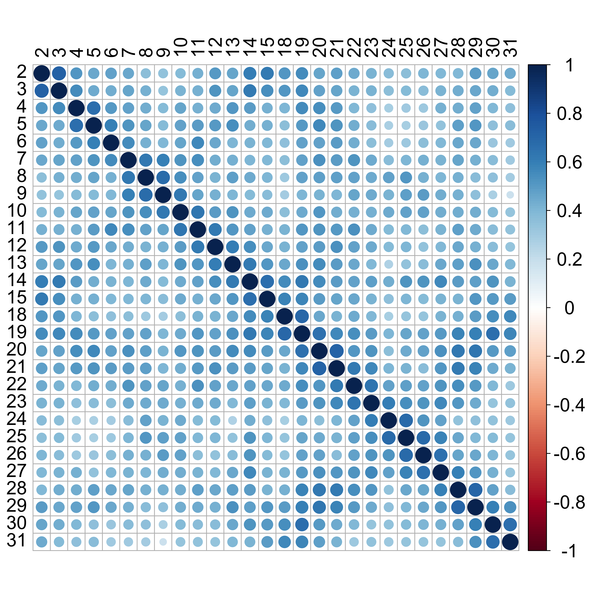

<style type="text/css">
.remark-slide-content {
    font-size: 26px;
    padding: 1em 2em 1em 2em;
}
</style>
```{r setup, include=FALSE}
options(htmltools.dir.version = FALSE)
knitr::opts_chunk$set(
  #fig.width=9, fig.height=3.5, fig.retina=3,
  fig.retina = 3,
  #out.height = "100%",
  cache = FALSE,
  echo = TRUE,
  message = FALSE, 
  warning = FALSE,
  hiline = TRUE
)
library(here)
library(emo)
library(tidyverse)
library(knitr)
library(xtable)
library(texreg)
library(sjPlot)
```

```{r xaringan-themer, include=FALSE, warning=FALSE}
library(xaringanthemer)
style_duo_accent(
  primary_color = "#002A5C",
  text_bold_color = "#008BB0",
  secondary_color = "#008BB0",
  inverse_header_color = "#FFFFFF"
)
```


.center[


# Matrix-variate regression for multilevel data

## DSI Seed Funding for Methodologists  

### Aya Mitani

### Dalla Lana School of Public Health

### `r Sys.Date()`
]

.pull-left[.center[
```{r, echo = FALSE, out.width=500}

```
]]

.pull-right[.center[
```{r, echo = FALSE, out.width=300}
knitr::include_graphics("image/UTDL003_Dalla-Lana_Logo_HRZ_RGB.png")
```
]]

---


# Traditional regression model

The outcome $Y_i$ for person $i$ is **univariate**

$$
\boldsymbol{Y} = \boldsymbol{X\beta} + \boldsymbol{\epsilon}
$$
--

\begin{equation*}
\left(\begin{array}{c} 
Y_{1}\\
Y_{2}\\
\vdots \\
Y_{n}
\end{array}\right)
=
\left(\begin{array}{cccc} 
1 & X_{11} & ... & X_{1p}\\
1 & X_{21} & ... & X_{2p}\\
\vdots & \vdots & \ddots & \vdots \\
1 & X_{n1} & ... & X_{np}  
\end{array}\right)
\left(\begin{array}{c} 
\beta_{0}\\
\beta_{1}\\
\vdots \\
\beta_{p}
\end{array}\right)
+
\left(\begin{array}{c} 
\varepsilon_{1}\\
\varepsilon_{2}\\
\vdots \\
\varepsilon_{n}
\end{array}\right)
\end{equation*}

--
$$
\boldsymbol{\hat{\beta}}=(\boldsymbol{X}^{T}\boldsymbol{X})^{-1}\boldsymbol{X}^{T}\boldsymbol{Y}
$$


---

# Matrix-variate outcome

Sometimes each person $i$ might contribute **multiple outcomes** represented in a **matrix**

\begin{equation*}
\boldsymbol{Y}_i 
=
\left(\begin{array}{cccc} 
y_{11} & y_{12} & ... & y_{1m}\\
y_{21} & y_{22} & ... & y_{2m}\\
\vdots & \vdots & \ddots & \vdots \\
y_{r1} & y_{r2} & ... & y_{rm}  
\end{array}\right)
\end{equation*}

For example,
- Data with repeated measures
- Imaging data

---

# Matrix-variate regression
- Then, rather than transforming each $\boldsymbol{Y}_i$ into a vector, it may be more straightforward to model $\boldsymbol{Y}_1$, $\boldsymbol{Y}_2$, ..., $\boldsymbol{Y}_n$ as matrices
<br/>
--

- The matrix-variate regression of $\boldsymbol{Y} (r \times m)$ on $\boldsymbol{X} (p1 \times p2)$ is
<br/>
--

\begin{equation}
\mathbf{Y = \mu + \beta_1 X \beta_2^T + \epsilon}
\end{equation}
where 
  - $\mu (r \times m)$ is matrix of the means ($\bar{\boldsymbol{Y}}$)
  - $\beta_1(r\times p_1)$ and $\beta_2 (m \times p2)$ are row and column coefficient matrices
  - $\epsilon(r\times m)$ is a matrix of errors with a matrix normal distribution

.footnote[Ding and Cook. [Matrix variate regressions and envelope models](http://onlinelibrary.wiley.com/doi/abs/10.1111/rssb.12247). J. R. Statist. Soc. B. (2018)]

---


# Example: Periodontal disease

.pull-left[
+ Periodontitis is the **6**th most prevalent disease in the world and a major cause of tooth loss in older adults

+ In Canada...
  
  - **16**% of adults have periodontitis
  
  - **4**% of adults have severe periodontitis
]
.pull-right[.center[
```{r, echo = FALSE, out.width=300}
knitr::include_graphics("image/perio.jpg")
```
]]

---


# Two measurements collected on each tooth

.pull-left[.center[
```{r, echo = FALSE, out.width=400}
knitr::include_graphics("image/tooth.jpg")
```
]]
.pull-right[
- AAP/CDC definition of severe periodontitis
  <!-- + Mild: 2+ sites with **AL** $\geq$ 3mm, and 2+ sites with **PD** $\geq$ 4mm or 1 site with **PD** $\geq$ 5mm -->
  <!-- + Moderate: 2+ sites with **AL** $\geq$ 4mm, or 2+ sites with **PD** $\geq$ 5mm  -->

> two or more sites with **AL** $\geq$ 6mm and one or more site with **PD** $\geq$ 5mm

- Many researchers are also interested in *jointly* modeling **AL** and **PD** 
]

.footnote[Kaye et al. [Metabolic Syndrome and Periodontal Disease Progression in Men](https://doi.org/10.1177/0022034516641053). J. Dent. Res. (2016)       
Mitani et al. [Marginal analysis of multiple outcomes with informative cluster size](http://onlinelibrary.wiley.com/doi/abs/10.1111/biom.13241). Biometrics. (2021)
]


---


# Matrix-variate model for AL and PD

For each subject
- $\boldsymbol{Y}( 28 \times 2)$ includes AL and PD data for 28 teeth
- $\boldsymbol{X} (2 \times 1)$ includes age and indicator for smoking

\begin{equation*}
\left(\begin{array}{cc} 
3 & 2 \\
3 & 3 \\
4 & 3 \\
\vdots & \vdots \\
3 & 2 \\
3 & 2 \\
4 & 3 
\end{array}\right) = 
\left(\begin{array}{cc} 
3.37 & 2.93  \\
3.12 & 2.88  \\
2.54 & 2.10  \\
\vdots & \vdots  \\
2.80 & 2.33  \\
3.35 & 3.01  \\
3.79 & 3.27 
\end{array}\right) + 
\left(\begin{array}{cc} 
\beta_{1\_11}& \beta_{1\_12}  \\
\beta_{1\_21}& \beta_{1\_22}  \\
\beta_{1\_31}& \beta_{1\_32}  \\
\vdots & \vdots  \\
\beta_{1\_261}& \beta_{1\_262}  \\
\beta_{1\_271}& \beta_{1\_272}  \\
\beta_{1\_281}& \beta_{1\_282} 
\end{array}\right)
\left(\begin{array}{c} 
40 \\
1
\end{array}\right)
\left(\begin{array}{c} 
\beta_{2\_11}\\
\beta_{2\_21} 
\end{array}\right)^T +
\boldsymbol{\epsilon}
\end{equation*}

---


# Estimated correlation between teeth 


.pull-left[.center[ 
```{r, echo = FALSE, out.width=250, fig.cap="Teeth numbering system"}

```
]]
.pull-right[.center[
```{r, echo = FALSE, out.width=450}

```
]]

.footnote[https://en.wikipedia.org/wiki/Universal_Numbering_System](https://en.wikipedia.org/wiki/Universal_Numbering_System)

---


# Estimated mean values for PD
.center[
```{r, echo = FALSE, out.width=750}

```
]
---


# Estimated mean values for AL
.center[
```{r, echo = FALSE, out.width=750}

```
]
---


# Advantages of matrix-variate regression
- Multilevel models generally include random effects to account for the correlations 

  + Matrix-variate regression does not include random effects
  
  + Variability within and between variables and occasions holds through the covariance matrix of the error term
  
  + No individual-varying parameters are assumed
  
- Matrix-variate analysis can be combined with multilevel models

- Consider both time-dependent and independent covariates and time-dependent responses

- Flexible and parsimonious

- Consider the correlations between rows and columns

---


# Why is matrix-variate regression not popular?
- Data with matrix-valued response were not commonly encountered until contemporary statistical applications

  + The response are universally reshaped as a vector
    
  + We have traditional longitudinal models for vector-valued responses.

- High-dimensional data may have sparsity and require regularization

- Computation and interpretation might be complicated when incorporating row and column covariance

- Not many existing estimation packages

---


# Methodology extensions

- Longitudinal data 

- More dimensions

- Non-normal errors 

- Missing data

---


# Applications
- **Papermaking**: 4 $\times$ 5 matrix $\boldsymbol{Y}$ (4 quality variables as a function of 5 beating times) for each sample and 4 $\times$ 5 matrix $\boldsymbol{X}$ (4 characteristics at 5 beating times) [[Viroli. (2012)](https://linkinghub.elsevier.com/retrieve/pii/S0047259X12000966)]

- **Crossover assay** of insulin based on rabbit blood sugar concentration: Each subject has a 5 $\times$ 2 matrix $\boldsymbol{Y}$ (5 measurements of blood sugar on each of two days) and 2 $\times$ 2 matrix $\boldsymbol{X}$ (two rows representing standard and test treatments and two columns representing two days) [[Ding and Cook. (2018)](http://onlinelibrary.wiley.com/doi/abs/10.1111/rssb.12247)]

- **Electroencephalogram data**: Each subject has measurements of electrical scalp activity as a 256 $\times$ 54 matrix $\boldsymbol{Y}$ and the predictor is binary [[Ding and Cook. (2018)](http://onlinelibrary.wiley.com/doi/abs/10.1111/rssb.12247)]

- **Longitudinal Study of Aging Danish Twins**: Each twin pair has 3 $\times$ 2 matrix $\boldsymbol{Y}$ (3 responses measuring cognitive function for each ]member of the twin) and multiple covariates related to cognitive function [[Anderlucci et al. (2014)](https://doi.org/10.6092/issn.1973-2201/5473)]

---


# Acknowledgements
.pull-left[.center[
```{r, echo = FALSE, out.width=300, fig.cap = "Shiyao Ying, PhD student in Biostatistics"}

```
]]
.pull-right[.center[
```{r, echo = FALSE, out.width=500}

```
```{r, echo = FALSE, out.width=150, fig.cap= "Dipankar Bandyopadhyay at VCU"}

```
]]

---
# Thank you

- Slides are available at: https://github.com/ayamitani/matrixvariate-presentation

- I can be reached at: aya.mitani@utoronto.ca
